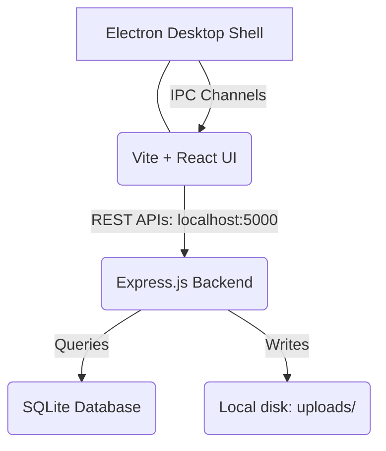
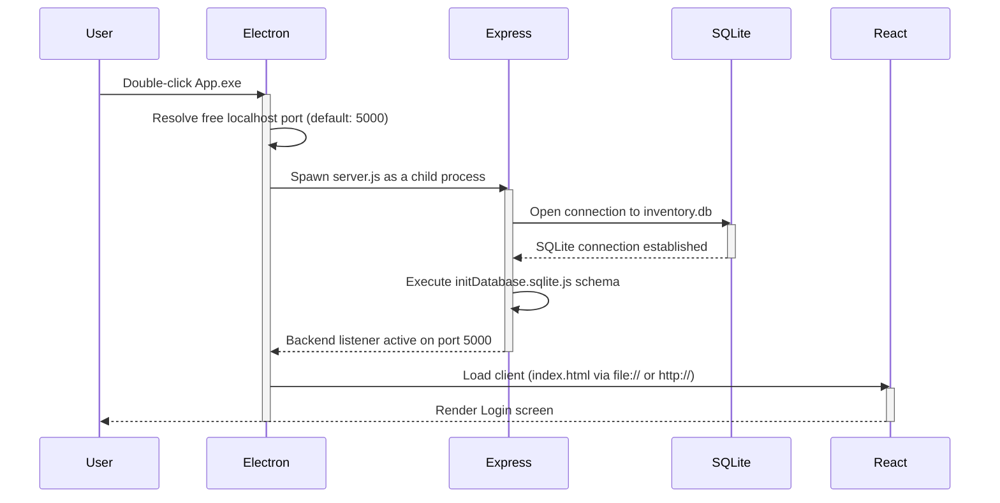
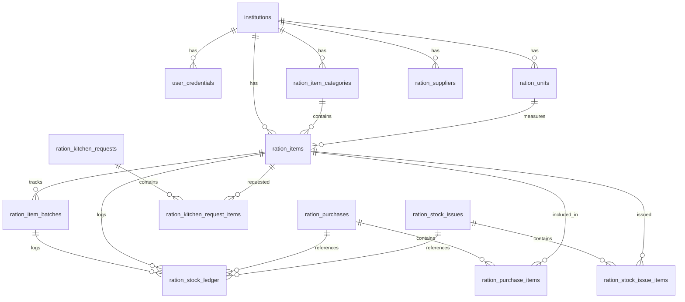

In simple, non-technical terms, **this is your requirement**:

---

# What I want to build

I want to build a **Windows desktop application** for **Ration Inventory Management**.

This application should work **completely offline**.

The user should simply install it like any normal Windows software and use it without needing the internet.

---

# How the user uses it

The user installs the software.

```
Double Click

RationInventory.exe
```

The application opens.

They log in.

They start managing inventory.

No browser.

No website.

No internet.

No cloud.

---

# What the software should do

The software should allow users to:

* Login
* Add Categories
* Add Units
* Add Suppliers
* Add Products
* Purchase Products (Stock In)
* Issue Products (Stock Out)
* View Current Stock
* Adjust Stock
* Perform Stock Audit
* Manage Kitchen Requests
* View Inventory Dashboard
* Print QR Labels
* Generate Reports
* Take Database Backups

---

# Barcode requirement

When adding a product:

### If the product already has a barcode

Example:

* Freedom Oil
* Maggi
* Coca-Cola

The user scans the existing barcode.

The system saves that barcode.

The same barcode is used forever.

No new barcode is created.

---

### If the product has no barcode

Example:

* Rice Container
* Dal Container
* Sugar Bin

The system generates its own QR code.

The QR sticker is printed.

The sticker is attached to the container.

The QR is used for future scanning.

---

# Images

The user can upload a product image.

The image is stored on the same computer.

No cloud storage is used.

---

# Database

All data is stored on the user's own computer.

The application should continue working even if there is no internet.

---

# Reports

The user can generate reports such as:

* Current Stock
* Purchase History
* Stock Issue
* Stock Adjustment
* Stock Audit
* Low Stock
* Expiry Report

Reports are saved locally.

---

# Backup

The software should allow taking backups of the database.

The backup file is saved to the computer.

If the computer changes, the backup can be restored.

---

# Performance

The software should be:

* Fast
* Stable
* Easy to use
* Production-ready
* Capable of handling thousands of products

---

# My existing project

I already have:

* React frontend
* Express backend
* Authentication
* Inventory modules
* Purchase module
* Stock Issue module
* Current Stock module
* Dashboard
* CRUD operations

I only want to keep the **Ration Inventory** modules.

I do **not** want PG management, tenants, institutions, expenses, or other unrelated features.

---

# One-line requirement

> **Build a professional Windows desktop Ration Inventory Management System using my existing React and Express project, keeping only the inventory modules, storing all data and files locally, working completely offline without any cloud or internet dependency, using existing manufacturer barcodes when available and generating internal QR codes only for products that do not already have a barcode.**


# Implementation Plan - Windows Desktop Ration Inventory Management System

This plan outlines the changes required to convert the existing React + Express + PostgreSQL web project into a standalone, completely offline Windows desktop application using Electron and SQLite (`better-sqlite3`). It keeps only the **Ration Inventory** modules, stores all files locally, generates internal QR codes when needed, and provides local reporting and database backup/restore features.

## User Review Required

> [!IMPORTANT]
> **Workspace Restore Operations**: The current workspace `Downloads/Inventory` is missing several directories containing base UI layouts and core permission models (e.g., `Layout`, `Menu`, `Restriction`, `UserActivity`) which were deleted during cleanup. The Ration Inventory modules directly depend on these layouts and models. We will copy them from the running project (`Desktop/folder/Management`) to our workspace, keeping only their core infrastructural classes and removing any screen components for unrelated features.
>
> **Default Authentication**: Since the app will run completely offline on a single computer, a default Super Admin account will be seeded upon database initialization:
> *   **Email**: `admin@ration.com`
> *   **Password**: `admin123`

## Proposed Changes

We will restructure the application by copying the required layout templates, rewriting the database layer, implementing Electron shell wrappers, creating local reporting endpoints, and setting up packaging configs.

---

### Component 1: Database Migration to SQLite (`better-sqlite3`)

#### [MODIFY] [Database.js](file:///c:/Users/Innovitegra%20Solution/Downloads/Inventory/Backend/Config/Database.js)
*   Replace PostgreSQL connection pool (`pg`) with a `better-sqlite3` database instance pointing to a local file (`inventory.db`).
*   Provide a query translation adapter to map PostgreSQL SQL queries dynamically to SQLite:
    *   Map parameter place-holders `$1, $2` to SQLite's positional parameters `?1, ?2`.
    *   Replace regular expression matching operators `~*` with SQLite's `REGEXP` operator.
    *   Register a custom `REGEXP` SQL function in SQLite to evaluate case-insensitive regex.
    *   Strip Postgres-specific typecasts like `::integer` and `::numeric`.
    *   Translate `GREATEST` calls to SQLite's multi-argument `MAX` scalar function.
*   Implement a mock client/transaction runner that exposes the exact same transaction callback API as the Postgres library.

#### [NEW] [initDatabase.sqlite.js](file:///c:/Users/Innovitegra%20Solution/Downloads/Inventory/Backend/Config/initDatabase.sqlite.js)
*   Create a clean SQLite schema script to set up all Ration Inventory tables, sequences, user credentials, super admins, pg admins, institutions, and menu configurations.
*   Seed the default user `admin@ration.com` (with hashed password `admin123`) and default menus for Ration Inventory (IDs 200 to 212).

---

### Component 2: Backend Cleanup and Local Storage

#### [MODIFY] [server.js](file:///c:/Users/Innovitegra%20Solution/Downloads/Inventory/Backend/server.js)
*   Switch database initialization to load `initDatabase.sqlite.js` instead of Postgres version.
*   Remove unused routes and endpoints (Institutions, PG Admins, Tenants, Expenses, Payment Reminders, and Asset Inventory).
*   Add configuration to read `USER_DATA_PATH` (provided by Electron) to resolve database and upload paths.

#### [MODIFY] [RationItemUploadMiddleware.js](file:///c:/Users/Innovitegra%20Solution/Downloads/Inventory/Backend/RationInventory/ItemMaster/RationItemUploadMiddleware.js)
*   Remove Cloudinary integration entirely.
*   Save uploaded images permanently inside the local `uploads/ration_items` folder.
*   Map the local URL path `/uploads/ration_items/filename` directly to `req.file.cloudinaryUrl` to preserve compatibility with existing backend models and React rendering code.

---

### Component 3: Core Infrastructure Restoring

#### [RESTORE] [Menu](file:///c:/Users/Innovitegra%20Solution/Downloads/Inventory/Backend/Menu)
*   Copy `MenuModel.js` from `Desktop/folder/Management/Backend/Menu` to handle role permissions.

#### [RESTORE] [Layout](file:///c:/Users/Innovitegra%20Solution/Downloads/Inventory/Frontend/src/Components/Layout)
*   Copy the layout elements (`Navbar.jsx`, `Sidebar.jsx`, `Header.jsx`) from the running project to restore page styling.
*   Modify `Sidebar.jsx` to update the brand name from `"BLR Stay"` to `"Ration Inventory"`.

#### [RESTORE] [Restriction & UserActivity](file:///c:/Users/Innovitegra%20Solution/Downloads/Inventory/Backend)
*   Copy `Restriction` and `UserActivity` directories from `Desktop/folder/Management/Backend` to prevent runtime resolution crashes.

---

### Component 4: Frontend Cleanup

#### [MODIFY] [index.jsx](file:///c:/Users/Innovitegra%20Solution/Downloads/Inventory/Frontend/src/Routes/index.jsx)
*   Remove route definitions and lazy imports for missing components (`pgAdminRoutes`, `tenantRoutes`, `expenseRoutes`, `inventoryRoutes`, `institutionRoutes`, `superAdminRoutes`) to ensure Vite compiles successfully.
*   Update `/dashboard` route to render a redirect (`Navigate`) to `/ration-inventory/inventory-dashboard`.

---

### Component 5: Reports Module (Local CSV/Excel Export)

#### [NEW] [RationReportRoutes.js](file:///c:/Users/Innovitegra%20Solution/Downloads/Inventory/Backend/RationInventory/Reports/RationReportRoutes.js)
*   Expose endpoints for generating reports: `/api/ration-reports/current-stock`, `/api/ration-reports/purchase-history`, `/api/ration-reports/stock-issue`, `/api/ration-reports/stock-adjustment`, `/api/ration-reports/stock-audit`, `/api/ration-reports/low-stock`, `/api/ration-reports/expiry-report`.
*   Support querying data and streaming it as a downloadable CSV/Excel.

#### [NEW] [RationReports.jsx](file:///c:/Users/Innovitegra%20Solution/Downloads/Inventory/Frontend/src/Components/RationInventory/Reports/RationReports.jsx)
*   Create a beautiful React view to select reports, apply filters (date range, category), and download reports directly to local system downloads.

---

### Component 6: Electron Desktop Shell and Packaging

#### [NEW] [main.js](file:///c:/Users/Innovitegra%20Solution/Downloads/Inventory/main.js)
*   Create Electron main process.
*   Start the Express server as a background child process, passing `USER_DATA_PATH` (i.e. `app.getPath('userData')`) to isolate application data.
*   Create window loading local Vite build files (`Frontend/dist/index.html`) in production or `http://localhost:5173` in development.
*   Implement IPC channels for:
    *   **Backup Database**: Prompts save-file dialog to export `inventory.db` to a user-selected path (e.g. `inventory_backup_2026-07-21.db`).
    *   **Restore Database**: Prompts open-file dialog to replace current `inventory.db` with a backup and alerts the user to reload the app.

#### [NEW] [package.json](file:///c:/Users/Innovitegra%20Solution/Downloads/Inventory/package.json)
*   Configure root scripts: `npm run dev` (concurrently start Vite, Express, and Electron), `npm run build` (build React frontend), and `npm run package` (bundle using `electron-builder` to produce `.exe` installer).
*   Add packaging configurations and native dependencies.

---

## Verification Plan

### Automated Verification
*   Compile/build the React app using Vite: `npm run build` inside `Frontend`.
*   Run the compiled application locally in Electron: `npm start` at root.
*   Verify SQLite queries translation by monitoring console logs.

### Manual Verification
*   **Login**: Verify default credentials (`admin@ration.com` / `admin123`) work offline.
*   **Master Lists**: Add and edit Categories, Units, Suppliers, and Products.
*   **Barcode/QR Code**: Scan standard manufacturer barcodes (or auto-generate internal QR codes when barcode is empty) and print QR sheets.
*   **Transactions**: Stock-In (Purchases), Kitchen Requests, and Stock-Out (Issues).
*   **Inventory Dashboard**: Check stock levels, values, and expiring batches.
*   **Reports**: Export reports locally and verify CSV/Excel contents.
*   **Backups**: Trigger "Database Backup" and verify `.db` file is successfully written. Restore backup and verify data reload.


# Desktop Application Architecture Design Blueprint
## Ration Inventory Management System (Offline Desktop)

This blueprint details the step-by-step transition from a multi-tenant Cloud PostgreSQL/Express/React web application into a single-user, high-performance, completely offline Windows desktop application using Electron and SQLite (`better-sqlite3`).

---

## Step 1: Existing Architecture Analysis & Code Cleanup

We must aggressively strip out all unrelated modules to leave a lean, maintainable desktop footprint. Unnecessary modules complicate the offline packaging process and waste CPU/memory overhead.

### 1. Folders & Files to Keep
*   **`Backend/RationInventory/`**: Keep all 11 subdirectories:
    *   `CategoryMaster`, `UnitMaster`, `SupplierMaster`, `ItemMaster`: Crucial for managing raw items and vendors.
    *   `Purchase`: Handles incoming inventory stock.
    *   `CurrentStock`: Computes live inventories.
    *   `KitchenRequest`: Receives ration requests.
    *   `StockIssue`: Dispenses items to the kitchen.
    *   `StockAdjustment`, `StockAudit`: Resolves inventory discrepancies.
    *   `InventoryDashboard`: Renders system summary.
*   **`Backend/Auth/`**: Contains login routes and token generation. Essential for authenticating users locally.
*   **`Backend/SuperAdmin/`**: Stores super admin models, required to authenticate the default offline system user.
*   **`Frontend/src/Components/RationInventory/`**: Frontend screen controllers matching the modules.
*   **`Frontend/src/Components/Layout/`** (Restored): Navbar, Sidebar, and Header layouts.
*   **`Frontend/src/Components/Restriction/`** (Restored): Restricts/grants menu access permissions.
*   **`Backend/Menu/`** (Restored): Provides the list of menu items on login.
*   **`Backend/Restriction/`** (Restored): Route-level authorization middleware.
*   **`Backend/UserActivity/`** (Restored): Local database logger for user login sessions.

### 2. Folders & Files to Delete (and Why)
*   **`Backend/Config/Cloudinary.js`**: Delete. Cloudinary is a cloud media storage API. Desktop uploads must write directly to the local directory `uploads/` on the host machine.
*   **`Backend/InventoryManagement/`**: Delete. This contains general property/asset tracking, which is unrelated to food ration inventories.
*   **`Backend/Config/migrations/`**: Delete. Raw SQL migrations for Postgres are obsolete since we initialize a fresh SQLite database from a single, static schema on first startup.
*   **`Backend/Institution/`, `Backend/PGAdmin/`, `Backend/Tenant/`, `Backend/Expenses/`, `Backend/PaymnetReminder/`**: Delete. These folders handle hostellers, rents, room structures, food expenses, and bills, which are unrelated to ration tracking.
*   **`Frontend/src/Components/` [Tenant, Expense, Institution, PGAdmin]**: Delete. Removes UI components for hostel management.
*   **`vercel.json`** & Vercel build files: Delete. Hosting configuration files are obsolete.

### 3. Files to Rename or Merge
*   **Rename `Backend/Config/initDatabase.js` to `initDatabase.sqlite.js`**: This file will contain clean, standard SQLite schemas instead of Neon/Postgres dialects.
*   **Merge server routes**: Clean up `server.js` by completely removing route declarations for institutions, PG admins, tenants, daily expenses, food menus, and payment reminders.

---

## Step 2: Proposed Project Folder Structure

This hierarchy organizes the project into a clean developer layout:

```text
RationInventoryApp/ (Root)
│
├── main.js                  # Electron Main Process (Starts child Express process & opens BrowserWindow)
├── package.json             # Root npm config, Electron configs, and Packaging scripts
├── tailwind.config.js       # Styling configuration
│
├── Backend/                 # Express Local Backend
│   ├── server.js            # Express Entrypoint (Resolves ports, mounts SQLite, starts listener)
│   ├── Config/
│   │   ├── Database.js      # SQLite Connection Manager (better-sqlite3 + regex support)
│   │   └── initDatabase.sqlite.js # SQLite Schema Initialization & Menu Seeding
│   ├── Auth/                # Local Credentials Handler
│   ├── Menu/                # Desktop Menu Provider
│   ├── Restriction/         # Menu permissions
│   ├── UserActivity/        # Login tracking
│   ├── uploads/             # Local Media Storage directory (images)
│   └── RationInventory/     # Inventory Modules
│       ├── CategoryMaster/
│       ├── UnitMaster/
│       ├── SupplierMaster/
│       ├── ItemMaster/
│       ├── Purchase/
│       ├── CurrentStock/
│       ├── KitchenRequest/
│       ├── StockIssue/
│       ├── StockAdjustment/
│       ├── StockAudit/
│       ├── InventoryDashboard/
│       └── Reports/         # Local CSV/Excel Report Generator
│
└── Frontend/                # Vite + React Client
    ├── package.json         # React dev dependencies
    ├── vite.config.js       # Vite build config
    └── src/
        ├── main.jsx         # Vite entrypoint
        ├── App.jsx          # Router mount
        ├── Pages/
        │   ├── Login/
        │   └── Dashboard/
        ├── Components/
        │   ├── Layout/      # Shared Sidebar, Header, Navbar
        │   └── RationInventory/ # Inventory Screens
        ├── Routes/          # Clean routes definition
        └── Utils/           # Local constants, barcode scanner utilities
```

---

## Step 3: Complete Desktop Application Flow

1.  **Installation**: The user runs the packaged `.exe` installer. It places the app in `AppData\Local` and creates a desktop shortcut.
2.  **App Startup**: The user double-clicks the shortcut. A splash screen loads briefly while the Electron main process spins up the Express server. The app opens directly in a dedicated Windows window (no web browser opens).
3.  **Offline Login**: The user inputs the seeded credentials: `admin@ration.com` / `admin123`. The system issues a local JWT.
4.  **Dashboard**: The home screen automatically loads the **Ration Inventory Dashboard**, showing stock indicators, low-stock warnings, and expiring batches.
5.  **Adding Masters**:
    *   **Categories & Units**: Add classification (e.g., *Grains*, *Dairy*) and unit metrics (e.g., *kg*, *Liters*).
    *   **Suppliers**: Input vendor contact details.
    *   **Item Master (Barcode scan)**: The user scans a manufacturer barcode. If empty, the system generates an internal QR code. They can upload an item image, which is instantly copied to the local `uploads/` directory on their C: drive.
6.  **Transactions**:
    *   **Purchase (Stock-In)**: Log purchases from suppliers. The system automatically records inventory levels, prices, batch codes, and expiration dates.
    *   **Current Stock**: View items currently in stock, filtered by category or expiry.
    *   **Kitchen Request**: Cooks enter requested ingredients for a meal.
    *   **Stock Issue (Stock-Out)**: Storekeepers approve and issue the requested items from specific batches.
    *   **Stock Adjustment & Audit**: Perform physical audits and adjust discrepancies.
7.  **QR Printing**: The user selects items, configures label margins, and prints custom sheets directly to a thermal or standard printer.
8.  **Reports**: The user filters stock lists or histories, clicking "Export" to save PDF or Excel reports directly into their Windows `Downloads` folder.
9.  **Database Backup**: Clicking "Take Backup" prompts a native Windows save dialog. The user selects a location (e.g., a USB drive), and SQLite writes a backup copy of the database instantly.

---

## Step 4: System Architecture & Communications

The application operates as a localized loopback client-server:



*   **Electron**: Acts as the desktop container (Chromium + Node.js) representing the visual window shell.
*   **Vite + React**: Manages the interface, UI rendering, inputs, and routing.
*   **Express.js Backend**: Runs as a localized background service executing controllers and routes.
*   **SQLite (`better-sqlite3`)**: Runs in-process inside the Express engine. It does not require a database server. It stores all data in a single, high-performance local file (`inventory.db`).
*   **Communication Layer**: React makes REST requests over local loopback (`http://localhost:5000/api`) to talk to Express. Electron communicates with the React UI via Electron IPC (Inter-Process Communication) for native tasks like file dialogs.

---

## Step 5: Double-Click App Bootstrap Flow



---

## Step 6: Database Design & Relationships

The SQLite database structure focuses exclusively on inventory tracking:



### Table Schema Definitions (SQLite Optimized)

1.  **`institutions`**: Essential workspace entity.
    *   `id` INTEGER PRIMARY KEY AUTOINCREMENT, `institution_name` TEXT, `status` TEXT DEFAULT 'active'
2.  **`user_credentials`**: Stores accounts.
    *   `id` INTEGER PRIMARY KEY AUTOINCREMENT, `email` TEXT UNIQUE, `password` TEXT, `role` TEXT DEFAULT 'super_admin', `institution_id` INTEGER REFERENCES institutions(id)
3.  **`ration_item_categories`**:
    *   `id` INTEGER PRIMARY KEY AUTOINCREMENT, `category_name` TEXT, `category_code` TEXT, `status` TEXT DEFAULT 'active', `institution_id` INTEGER REFERENCES institutions(id)
4.  **`ration_units`**:
    *   `id` INTEGER PRIMARY KEY AUTOINCREMENT, `unit_name` TEXT, `unit_code` TEXT, `allow_decimal` INTEGER DEFAULT 1, `status` TEXT DEFAULT 'active', `institution_id` INTEGER REFERENCES institutions(id)
5.  **`ration_suppliers`**:
    *   `id` INTEGER PRIMARY KEY AUTOINCREMENT, `supplier_name` TEXT, `supplier_code` TEXT, `phone` TEXT, `email` TEXT, `status` TEXT DEFAULT 'active', `institution_id` INTEGER REFERENCES institutions(id)
6.  **`ration_items`**:
    *   `id` INTEGER PRIMARY KEY AUTOINCREMENT, `item_name` TEXT, `item_code` TEXT, `sku_id` TEXT UNIQUE, `barcode` TEXT, `category_id` INTEGER REFERENCES ration_item_categories(id), `unit_id` INTEGER REFERENCES ration_units(id), `image_url` TEXT, `minimum_stock` REAL DEFAULT 0.0, `default_purchase_price` REAL DEFAULT 0.0, `batch_tracking` INTEGER DEFAULT 0, `expiry_tracking` INTEGER DEFAULT 0, `status` TEXT DEFAULT 'active', `institution_id` INTEGER REFERENCES institutions(id)
7.  **`ration_item_batches`**: Tracks specific batches.
    *   `id` INTEGER PRIMARY KEY AUTOINCREMENT, `item_id` INTEGER REFERENCES ration_items(id), `batch_number` TEXT, `manufacturing_date` TEXT, `expiry_date` TEXT, `initial_quantity` REAL DEFAULT 0.0, `remaining_quantity` REAL DEFAULT 0.0, `status` TEXT DEFAULT 'active', `institution_id` INTEGER REFERENCES institutions(id)
8.  **`ration_purchases`**:
    *   `id` INTEGER PRIMARY KEY AUTOINCREMENT, `purchase_number` TEXT, `purchase_date` TEXT, `supplier_id` INTEGER REFERENCES ration_suppliers(id), `sub_total` REAL, `grand_total` REAL, `status` TEXT DEFAULT 'draft', `institution_id` INTEGER REFERENCES institutions(id)
9.  **`ration_purchase_items`**:
    *   `id` INTEGER PRIMARY KEY AUTOINCREMENT, `purchase_id` INTEGER REFERENCES ration_purchases(id) ON DELETE CASCADE, `item_id` INTEGER REFERENCES ration_items(id), `batch_id` INTEGER REFERENCES ration_item_batches(id), `quantity` REAL, `unit_price` REAL, `line_total` REAL
10. **`ration_stock_ledger`**: Inventory transactional ledger.
    *   `id` INTEGER PRIMARY KEY AUTOINCREMENT, `item_id` INTEGER REFERENCES ration_items(id), `batch_id` INTEGER REFERENCES ration_item_batches(id), `reference_type` TEXT, `reference_id` INTEGER, `reference_number` TEXT, `opening_stock` REAL, `quantity_in` REAL DEFAULT 0.0, `quantity_out` REAL DEFAULT 0.0, `closing_stock` REAL, `transaction_date` TEXT DEFAULT CURRENT_TIMESTAMP, `institution_id` INTEGER REFERENCES institutions(id)

### Stock Calculations Formula
Current stock is never calculated using a manual state column in the items table. It is always queried dynamically from the ledger:
$$\text{Current Stock} = \sum (\text{quantity\_in}) - \sum (\text{quantity\_out})$$

```sql
SELECT COALESCE(SUM(quantity_in - quantity_out), 0) AS current_stock 
FROM ration_stock_ledger 
WHERE item_id = ? AND institution_id = ?;
```

---

## Step 7: Architectural Optimization & Best Practices

1.  **Custom Query Translation Layer**: Instead of manually rewriting all SQL files and backend queries, we will intercept them inside the `Database.js` query utility. By replacing parameters dynamically (e.g. `query.replace(/\$(\d+)/g, '?$1')`), we keep existing model controllers intact while ensuring compatibility with SQLite.
2.  **IPC-Driven Database Backup**: We avoid raw file copies in Express. Instead, we call the native Electron `dialog` API in the main process to prompt a secure save/open UI. This maintains system security by isolating backup file system access inside Electron.
3.  **Local Image Fallback**: If an item image has no local path, we serve a static SVG placeholder via React rather than throwing a broken link.
4.  **Automatic DB Optimization**: Configure SQLite PRAGMAs on database connection:
    ```sql
    PRAGMA journal_mode = WAL;    -- Faster concurrent writes
    PRAGMA synchronous = NORMAL;  -- High performance database commits
    PRAGMA foreign_keys = ON;     -- Force relational database integrity
    ```
